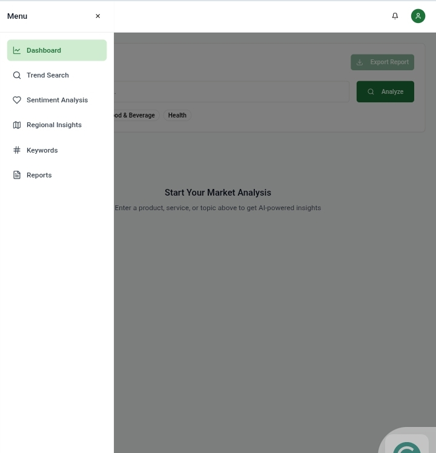
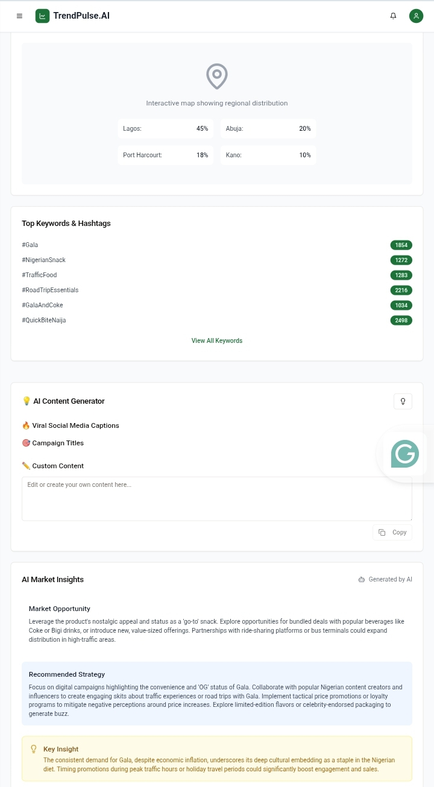
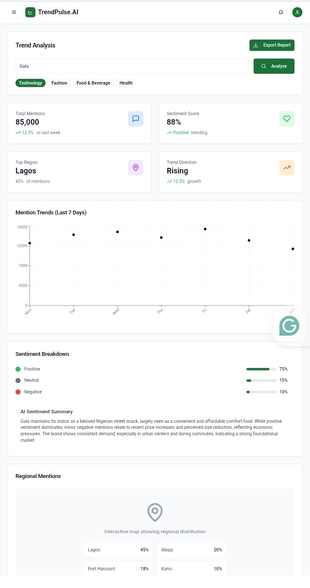

# 📊 TrendPulse.AI — Market Intelligence Dashboard

## Overview

**TrendPulse.AI** is a full-stack AI-powered market intelligence dashboard that analyzes trends and generates insights using AI. The application provides comprehensive market analysis including sentiment analysis, regional data, keyword trends, and AI-powered recommendations for market opportunities and strategies.

Built with a modern MERN (MongoDB, Express, React, Node) stack, AI via Google Gemini 2.5 Flash, and full TypeScript support — the platform empowers Nigerian marketers, agents, and businesses to make smarter, faster, data-backed marketing decisions.

## 🎯 Features

- 🔍 AI-Powered Trend Analyzer
- 📊 Real-time Trend Graphs
- 🏷️ Top Hashtags and Keywords
- 🌍 Geo-Location Heatmap
- 😡 AI Sentiment Analysis
- 📣 Viral Trend Prediction Alerts
- ✍️ AI Content Idea Generator
- 📈 Competitor Trend Comparison
- 📃 Downloadable Market Report PDFs
- 📊 Industry Category Leaderboards
- 📝 Public Trend Suggestion Form
- 📦 AI-Powered Campaign Title Generator
- 📱 Mobile-First, Fully Responsive UI

## 📱 Screenshots

| Dashboard View | AI Insights | Geo Heatmap |
|:---------------|:-------------|:-------------|
|  |  |  |

> 📸 **Create a `/screenshots/` folder in your repo and add images as `dashboard.png`, `ai-insights.png`, `heatmap.png` etc.**

## 📦 System Architecture

### Frontend  
- React 18 with TypeScript  
- Tailwind CSS (with shadcn/ui)  
- React Query (TanStack Query)  
- Wouter (routing)  
- Recharts (data visualization)  
- Radix UI primitives  
- Vite (build tool)

### Backend  
- Node.js + Express.js (TypeScript, ES modules)  
- PostgreSQL (Neon serverless)  
- Drizzle ORM  
- Google Gemini 2.5 Flash AI API  
- connect-pg-simple (session management)

## 📂 Project Structure

Trendpulse.AI/ ├── client/ │   ├── src/components/ │   ├── src/pages/ │   ├── src/App.tsx │   ├── public/ │   └── vite.config.ts ├── server/ │   ├── models/ │   ├── routes/ │   ├── server.ts ├── shared/ │   ├── schemas/ │   └── types/ ├── screenshots/ ├── .env ├── LICENSE ├── README.md └── package.json

## 🚀 Deployment

| Live Demo | Video Walkthrough |
|:------------|:----------------|
| 🔗 [Deployed App](#) | 📺 [Demo Video](#) |

> Replace `#` with your final deployed links.

## 👤 Developer

**Akolo Bulus**

- 🔗 [GitHub](https://github.com/akolobulus)
- 🔗 [LinkedIn](https://www.linkedin.com/in/akolo-bulus)
- 🔗 [Instagram](https://www.instagram.com/heisakolo)
- 🔗 [X (Twitter)](https://x.com/BulusAkolo)
- 🔗 [Linktree](https://linktr.ee/akolobulus)

## 📦 License

MIT License © 2025 Akolo Bulus

## 📈 Development Workflow

- Vite dev server with HMR for frontend  
- TypeScript strict type checking  
- Drizzle Kit for database migrations  
- React Query for client-server state  
- Google Gemini AI API for trend analysis  
- Request/response logging middleware  

## 📌 Requirements

- Node.js  
- PostgreSQL (Neon Database URL)
- Gemini API Key

## 📊 API Endpoints

- `POST /api/analyze` — Run trend analysis query  
- `GET /api/analysis/:query` — Fetch existing analysis  

## 📣 Contributing

Want to improve this? PRs welcome!  
Please fork, add your changes, and open a pull request.

